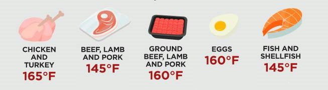
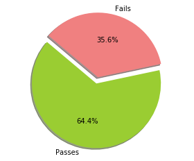
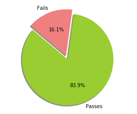
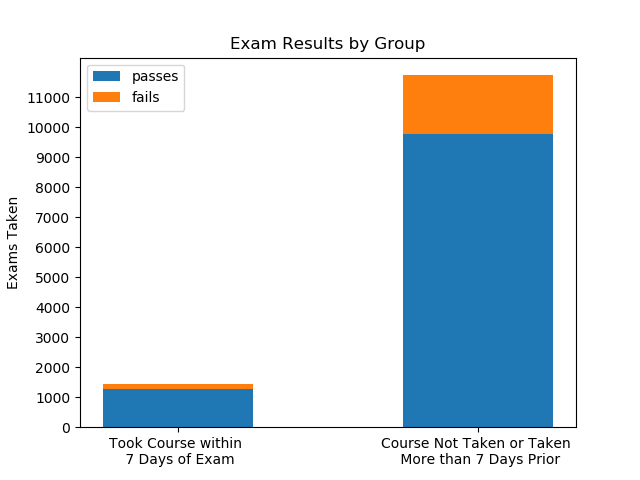

# Is on the Job Food Safety Training at QSRs enough? How Does it Compare to Accredited Programs?

# Background

The American diet is an ever-changing landscape. Trends and fad-diets come and go, a lot of times without a good understanding of the long-term effects. A perfect example being the "low-fat" diet (and the onslaught of manufactured, low-fat, ready-to-eat products that came with it). Luckily, the "slow food movement" is upon us. More and more, people want to know "where does my food come from?", "how was this prepared?", and "can I pronounce the list of ingredients?". While our food culture is slowing, the average American's life is not. Luckily for the consumer, with supply comes demand, and Quick Service Restaurants that care about these same things have popped up everywhere, giving busy Americans plenty of options for food-on-the-go.

While this all sounds great, it does introduce new health risks that were not so much a worry in the traditional fast-food arena. Without looking it up, are you able to identify the hot holding temperature for chicken? How about for steak? Do you know what a hot holding temperature is? If you aren't able to spout out these answers, you probably aren't alone. It also is probabilistic that if a McDonald's employee didn't know the answer to these questions, your health wouldn't be at risk. McDonald's is able to mitigate health risks by doing things like having all raw foods, that won't end up being cooked (i.e chopped lettuce or cut tomatoes) prepped and delivered to the restaurant pre-packaged and ready to serve, greatly diminishing the risk of cross-contamination. Unfortunately, many of the techniques that limit the public's exposure to health risks, can also have large impacts on the integrity of the food in front of you.

So, when you walk through the door of your favorite fast-casual restaurant, and you look behind the line into the kitchen and see the line cook slinging raw chicken thighs, all ranging in thickness and size, onto the grill, I bet you want to be confident that that person knows the hot holding temperature for chicken, right?

# The Problem

Food safety manager certification training and exams have traditionally been delivered in a classroom setting due to the target audience (restaurant employees) and proctor requirements. It has been only recently that online offerings have become available. Because of the proctor requirements, the online course and exam are sold as separate products, allowing people to take the exam without ever taking the course, despite company policy.

Regulation surrounding food safety certifications is on the rise and companies spend a lot of resources, both time and money, to protect the consumer (and their bottom line). I want to know, where are those resources best spent? Are QSR managers learning enough on the job to pass an accredited Food Safety Manager exam? Or is money spent on pre-exam courses and the time to take those courses well spent?

# Data
The data I used was provided with permission by an a popular QSR company.

#### Exam Activity Report
Report contains records corresponding to an instance of an employee taking a ServSafe Food Safety Manager exam.
 * 35,644 records
 * Includes passes and fails
 * Important features:  
   * Employee ID (unique person identifier within the company)
   * Exam Date
   * Pass/fail
   * Raw exam score

#### Course Activity Report
Report contains records corresponding to an instance of an employee "purchasing" or adding a ServSafe Food Safety Manager course to their account.
 * 19,307 records
 * Record is added as soon as course is added to a profile. That same record is updated as progress is made.
 * Shows snapshot of current status at time report was compiled.
 * Important features:  
   * Employee ID (unique person identifier within the company)
   * First Login & Last Login date
   * Current Section (course broken into 11 sections)
   * Post-course assessment score (if taken)

#### Limiting the Data Set  
 1. Web-delivery exams only --> Remove paper exam records
   * Data corresponding to classroom/paper exams exists and is included on the Exam Activity Report, but data on classroom courses does not exist.
   * While it can be assumed that anyone who took a paper exam, also took the course prior, I want to make sure I am comparing apples to apples, and therefore removed these records.  
 2. First-attempt exam records only  
   * Allows reduction of other noise that could effect the outcome of an exam (like for example, having a similar exam previously)  
 3. First-attempts records on or after 1/1/2017 only  
   * Initial roll-out (3/1/2016) and imposed deadlines for all managers to be certified are believed to have caused panic and a substantial increase in failures in the months following  
 4. Courses records with a current section of 10 or 11 (out of 11) counted as "course taken".  

#### EDA
First, I want to quickly check to see if my assumption about inflated failure rates after roll-out was accurate.  

Passes and failures for exams taken between 3/1/2016 and 12/31/2016:  
  
Passes and failures for exam taken 1/1/2017 and 2/6/2019:

Now let's get a feel of what our pass rates look like for the two groups (those who took the course within 7 days of taking the exam, and those who didn't).

We can see that our two categories are unevenly weighted. Because I am am comparing proportions, and my categories are unevenly weighted, I will use Bayesian A/B Testing to analyze if the passing rates are statistically different.

#### Bayesian A/B Testing
First, what is the passing rate for each group?

Took Course Within 7 Days:  
1283 passes / 1445 attempts = 88.8%  

Did Not Take Course (or took course more than 7 days prior):  
9786 passes / 11742 attempts = 83.3%

So, knowing that I am working with only a sample of the true population, can I confidentially say that employees who take the course within 7 days of the exam, actually increase their chance of passing by 5%? Let's find out!

Creating beta distributions for each group, and plotting the distributions together is VERY telling:  

  
The distributions do not overlap, meaning if were to pull a random variable blindly from a group of all random variables for each distribution, we would be able to identify which distribution it came from, simply by looking at the value, 100% of the time.  

In addition, if we were to pull a random variable from each distribution, 100% of the time, our RV from the distribution for those that take the course would be larger than the RV from the distribution for those that didn't take the course. Because of this, I can say 100% credibility, that it is always better to take the course before taking the exam.  

I also have 95.0% credible interval for passing rate of employees who take the course within 7 days of taking the exam: 0.871 (lower bound) - 0.903 (upper bound)
95.0% credible interval for passing rate of employees who take the course within 7 days of taking the exam: 0.871 (lower bound) - 0.903 (upper bound).
